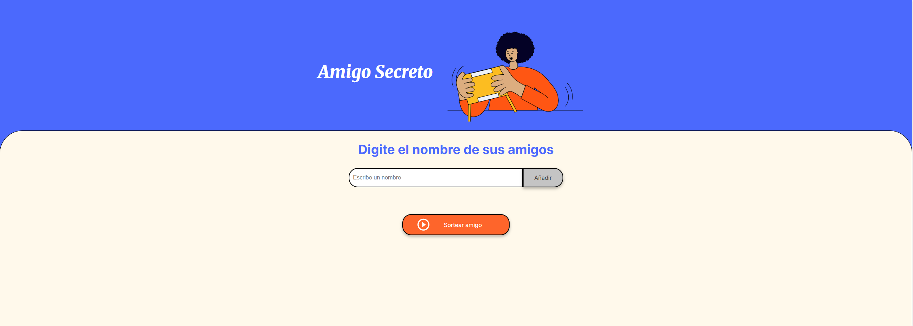

# Amigo_Secreto
Challenge Amigo Secreto Alura Latam

-- Descripción Challenge Amigo Secreto 

El siguiente poyecto tiene como finalidad, aplicar todos los conocimientos y el aprendizaje obtenido durante el curso Lógica de Programación G8 - ONE, dictado por Alura Latam.

# Nombre Repositorio

> El respositorio se llama Amigo_Secreto y se encuentra en la siguiente ruta: SirCapo/Amigo_Secreto.

## Lenguajes de programación utilizados

- Html
- Css
- JavaScript

# Página inicial

